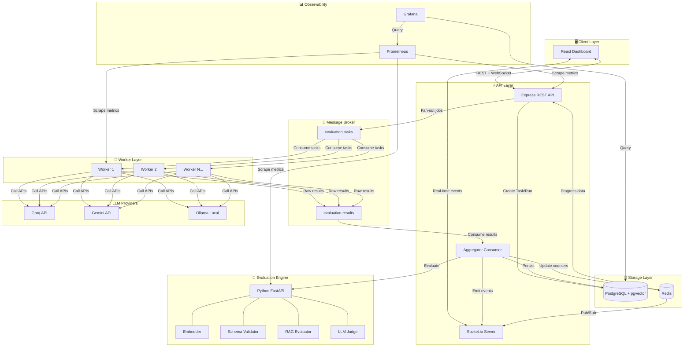
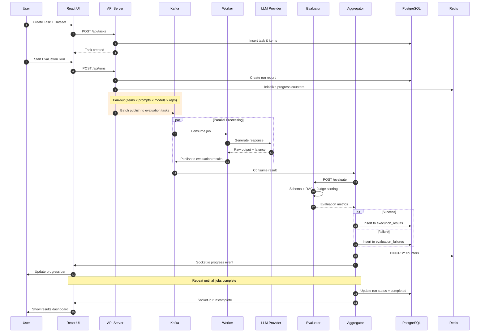
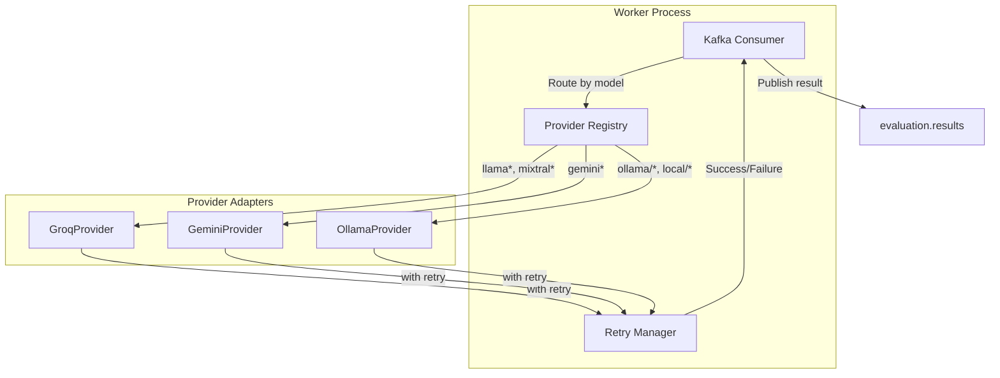
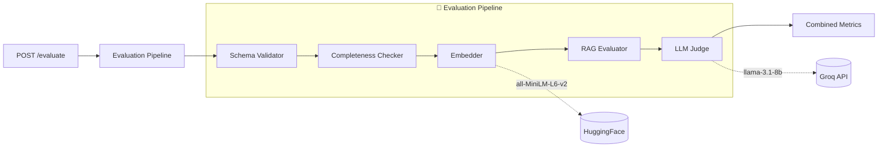
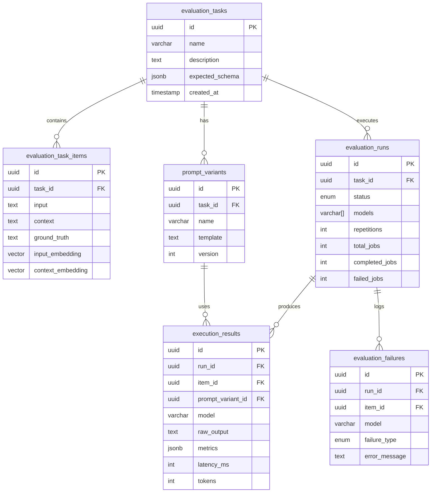
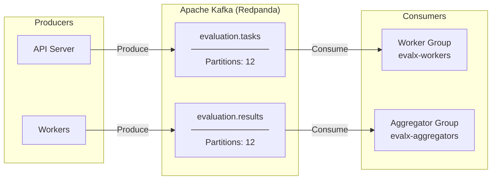
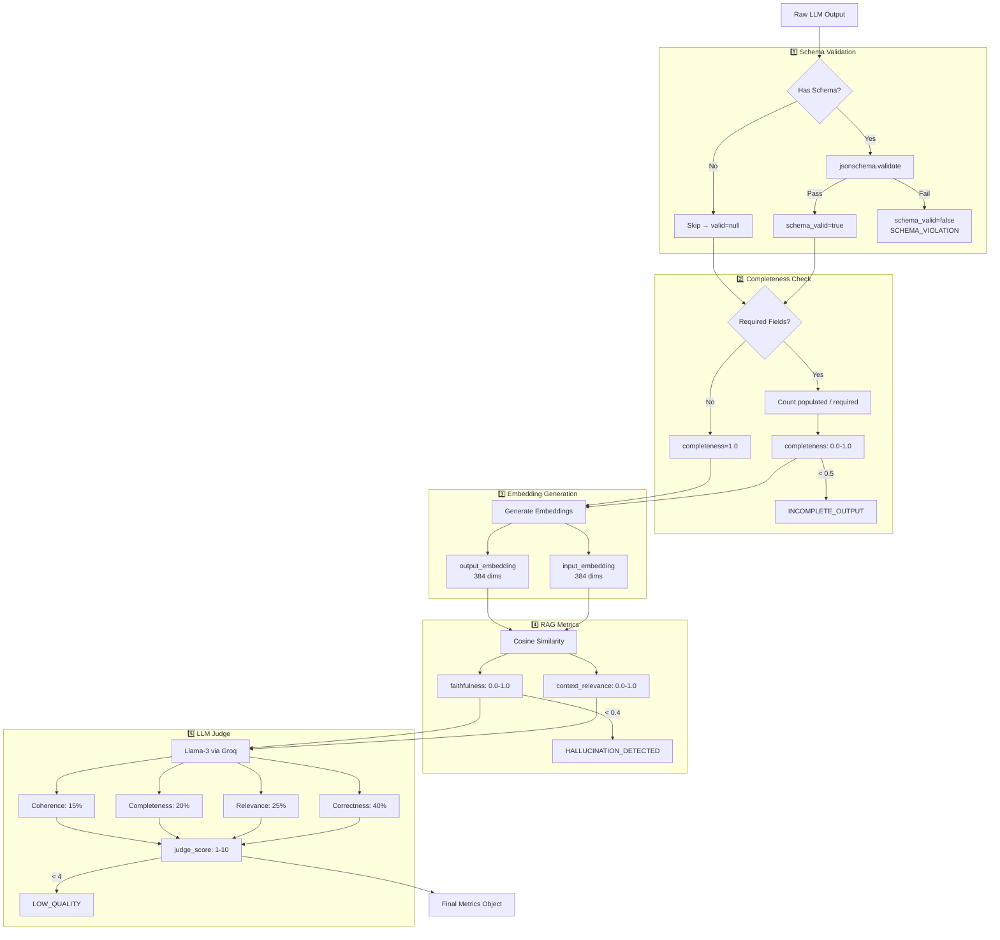
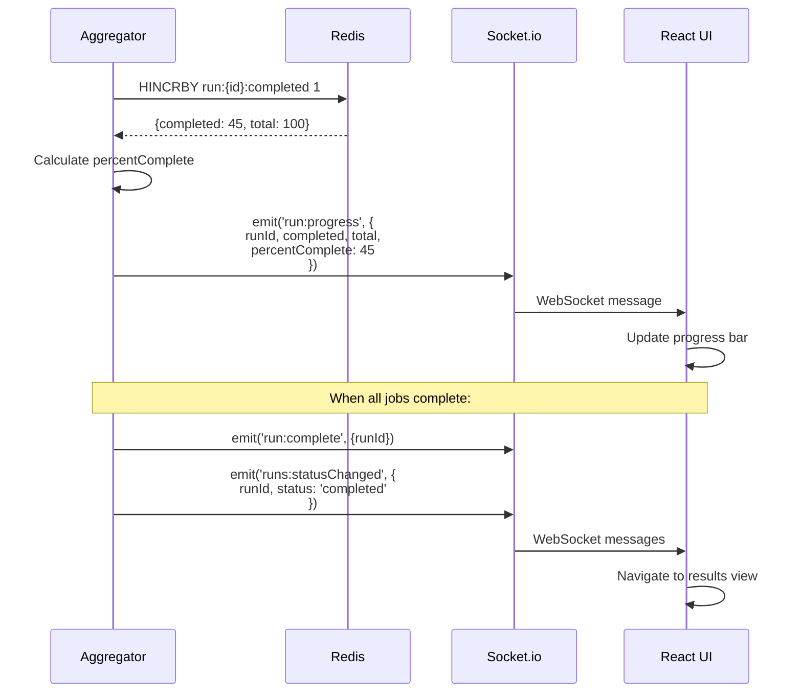
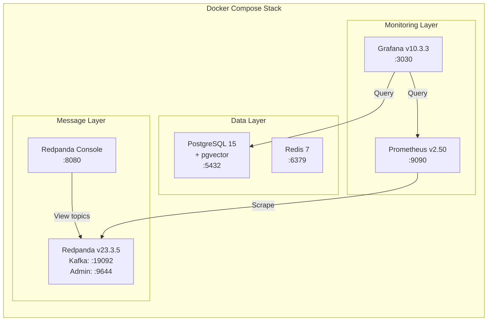

# 🏗️ EvalX Architecture

> A visual guide to the system architecture, data flows, and component interactions

---

## 📋 Table of Contents

- [System Overview](#-system-overview)
- [High-Level Architecture](#-high-level-architecture)
- [Data Flow](#-data-flow)
- [Component Breakdown](#-component-breakdown)
- [Database Schema](#-database-schema)
- [Kafka Topics & Message Flow](#-kafka-topics--message-flow)
- [Evaluation Pipeline](#-evaluation-pipeline)
- [Real-Time Updates](#-real-time-updates)
- [Infrastructure Services](#-infrastructure-services)

---

## 🎯 System Overview

EvalX follows an **event-driven microservices architecture** where components communicate asynchronously through Kafka. This design enables:

- **Horizontal scaling** of workers for high throughput
- **Fault tolerance** through message persistence and retries
- **Real-time monitoring** via Redis counters and Socket.io
- **Separation of concerns** between API, workers, and evaluation logic

---

## 🏛️ High-Level Architecture



---

## 🔄 Data Flow

### Run Execution Sequence



---

## 🧩 Component Breakdown

### API Server (`/api`)

```mermaid
flowchart LR
    subgraph Express["Express.js Server"]
        direction TB
        ROUTES[Routes]
        MW[Middleware]
        WS[Socket.io]
    end
    
    subgraph Routes["API Routes"]
        T[/api/tasks]
        R[/api/runs]
        RES[/api/results]
        P[/api/prompts]
        S[/api/stats]
    end
    
    subgraph Services["Internal Services"]
        DB[Database Pool]
        REDIS[Redis Client]
        KAFKA[Kafka Producer]
        AGG[Aggregator Consumer]
    end
    
    ROUTES --> T & R & RES & P & S
    Express --> Services
    AGG -->|Writes| DB
    AGG -->|Updates| REDIS
    AGG -->|Emits| WS
```

**Key Responsibilities:**
| Module | Purpose |
|--------|---------|
| `routes/tasks.js` | CRUD for evaluation tasks and dataset items |
| `routes/runs.js` | Create, start, stop runs; fan-out to Kafka |
| `routes/results.js` | Query results, model comparisons, failures |
| `aggregator/` | Consume results, persist, update progress |
| `lib/socket.js` | Real-time event broadcasting |

---

### Worker (`/worker`)



**Provider Routing:**
```
Model Name Pattern    →  Provider
─────────────────────────────────
llama-3*, mixtral*   →  Groq
gemini-1.5-*         →  Gemini  
ollama/*, local/*    →  Ollama (local)
```

---

### Evaluator (`/evaluator`)



**Evaluation Metrics:**
| Metric | Type | Description |
|--------|------|-------------|
| `schema_valid` | bool | JSON schema validation pass/fail |
| `completeness` | 0.0-1.0 | Fraction of required fields populated |
| `context_relevance` | 0.0-1.0 | Cosine similarity (question ↔ context) |
| `faithfulness` | 0.0-1.0 | Answer grounded in context |
| `judge_score` | 1-10 | LLM quality assessment |

---

## 🗃️ Database Schema



**Failure Type Enum:**
```sql
CREATE TYPE failure_type AS ENUM (
    'SCHEMA_VIOLATION',
    'INCOMPLETE_OUTPUT', 
    'HALLUCINATION_DETECTED',
    'LOW_QUALITY',
    'TIMEOUT',
    'PROVIDER_ERROR',
    'EVALUATOR_ERROR'
);
```

---

## 📨 Kafka Topics & Message Flow



### Message Schemas

**evaluation.tasks:**
```json
{
  "jobId": "uuid",
  "runId": "uuid",
  "itemId": "uuid",
  "promptVariantId": "uuid",
  "model": "llama-3.3-70b-versatile",
  "input": "What is the capital of France?",
  "context": "France is a country in Europe...",
  "groundTruth": "Paris",
  "promptTemplate": "Answer: {{input}}\nContext: {{context}}",
  "expectedSchema": { ... }
}
```

**evaluation.results:**
```json
{
  "jobId": "uuid",
  "runId": "uuid",
  "itemId": "uuid",
  "promptVariantId": "uuid",
  "model": "llama-3.3-70b-versatile",
  "success": true,
  "output": "The capital of France is Paris.",
  "latencyMs": 234,
  "tokens": 45,
  "input": "...",
  "context": "...",
  "groundTruth": "..."
}
```

---

## 🔬 Evaluation Pipeline



---

## 🔴 Real-Time Updates



**Socket.io Events:**
| Event | Direction | Payload |
|-------|-----------|---------|
| `subscribe:run` | Client → Server | `{ runId }` |
| `run:progress` | Server → Client | `{ runId, completed, failed, total, percentComplete }` |
| `run:started` | Server → Client | `{ runId }` |
| `run:complete` | Server → Client | `{ runId, summary }` |
| `runs:statusChanged` | Server → All | `{ runId, status }` |

---

## 🐳 Infrastructure Services



**Service Healthchecks:**
```yaml
PostgreSQL:  pg_isready -U evalx -d evalx
Redis:       redis-cli ping
Redpanda:    rpk cluster health | grep 'Healthy'
```

---

## 📁 Directory Structure

```
EvalX/
├── api/                          # Node.js API Server
│   └── src/
│       ├── routes/               # Express routes
│       │   ├── tasks.js          # Task CRUD
│       │   ├── runs.js           # Run management
│       │   ├── results.js        # Results queries
│       │   └── prompts.js        # Prompt variants
│       ├── aggregator/           # Kafka consumer + persistence
│       │   ├── consumer.js       # Kafka setup
│       │   ├── handler.js        # Result processing
│       │   └── persistence.js    # DB writes
│       ├── lib/                  # Shared utilities
│       │   ├── db.js             # PostgreSQL pool
│       │   ├── redis.js          # Redis client
│       │   ├── kafka.js          # Kafka producer
│       │   └── socket.js         # Socket.io setup
│       └── index.js              # Entry point
│
├── worker/                       # Node.js Worker
│   └── src/
│       ├── providers/            # LLM provider adapters
│       │   ├── groq.js
│       │   ├── gemini.js
│       │   └── ollama.js
│       ├── kafkaWorker.js        # Consumer + routing
│       └── index.js              # Entry point
│
├── evaluator/                    # Python FastAPI
│   └── src/
│       ├── routes/
│       │   └── evaluate.py       # POST /evaluate endpoint
│       ├── services/
│       │   ├── schema_validator.py
│       │   ├── embedder.py
│       │   ├── rag_evaluator.py
│       │   └── llm_judge.py
│       └── main.py               # FastAPI app
│
├── frontend/                     # React + Vite
│   └── src/
│       ├── pages/
│       │   ├── TasksPage.jsx
│       │   ├── RunsPage.jsx
│       │   └── ResultsPage.jsx
│       ├── components/
│       ├── hooks/                # useRunProgress, etc.
│       └── lib/api.js            # API client
│
├── db/
│   └── migrations/
│       └── 001_init.sql          # Schema + indexes
│
├── infra/
│   ├── prometheus/
│   │   └── prometheus.yml
│   └── grafana/
│       └── provisioning/
│           ├── datasources/
│           └── dashboards/
│
└── docker-compose.yaml           # Infrastructure stack
```

---

<p align="center">
  <em>Architecture designed for scalability, observability, and developer happiness 🎉</em>
</p>
